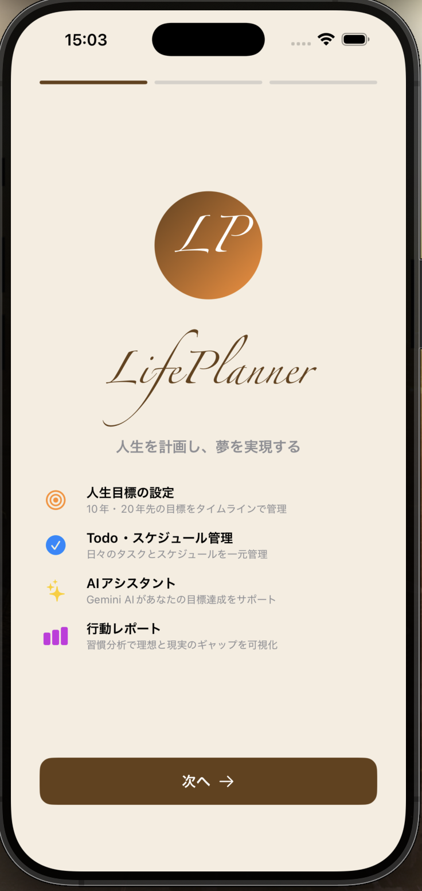
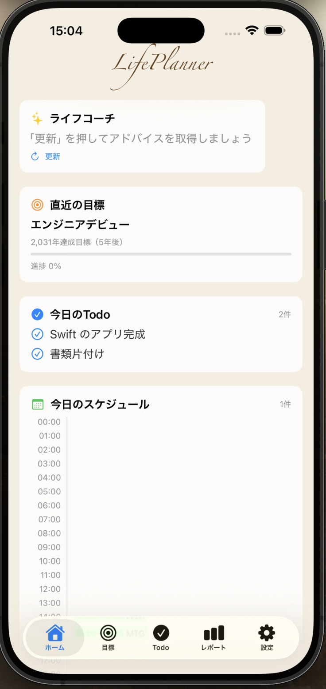
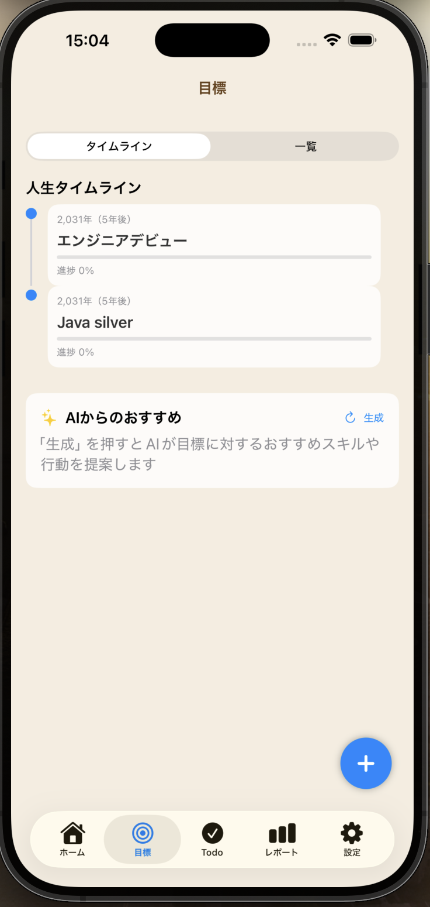
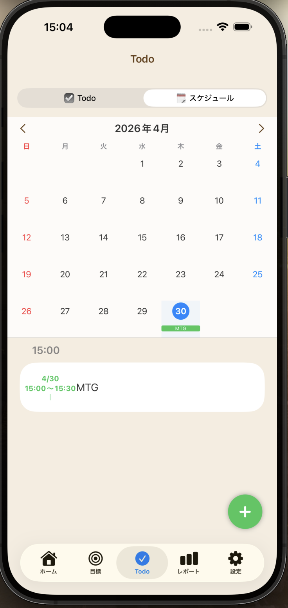
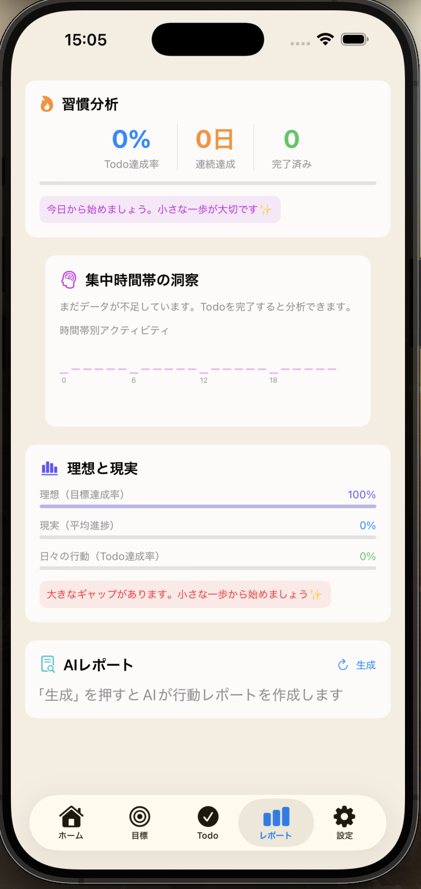
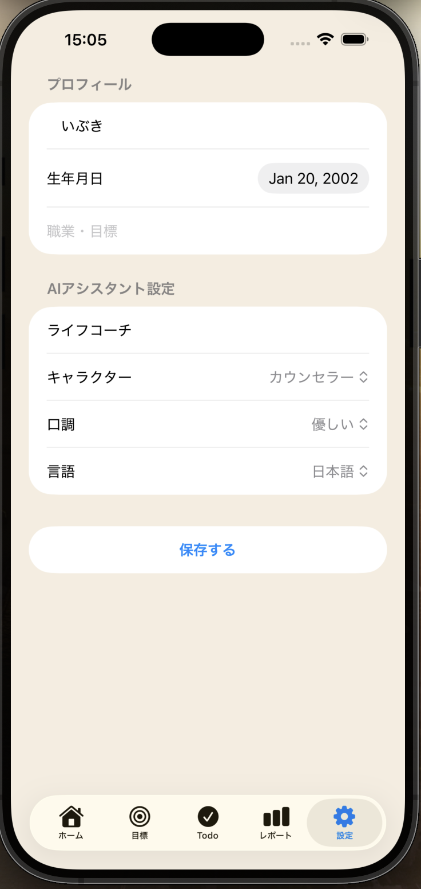

# LifePlanner

  

  <strong>人生を計画し、夢を実現するiOSアプリ</strong>

## 📱 スクリーンショット

  
  
  
  
  

## 📝 概要

LifePlannerは、人生単位の目標設定から日々のTodo管理まで一元管理できるiOSアプリです。
自分自身がエンジニアとして学習・成長していく中で「長期的な目標と日々の行動を繋げるツールが欲しい」という課題から開発しました。
Google Gemini APIを活用したAIアシスタントが、目標達成に向けたアドバイスや未来シミュレーションを提供します。

## ✨ 主な機能

### 🎯 人生目標管理
- 10年・20年後など長期目標をタイムライン形式で管理
- 年数指定または日付指定で柔軟に目標設定
- 進捗スライダーでリアルタイム更新
- AIによる未来シミュレーション

### ☑️ Todo・スケジュール管理
- TodoとスケジュールをGoogleカレンダー風に管理
- 締め切り・優先度・目標との紐づけ
- Zoom URL・場所の設定
- スワイプで削除

### 🤖 AIアシスタント（Google Gemini API）
- 毎日のパーソナライズされたアドバイス
- 目標に対するおすすめスキル・行動の提案
- 行動レポートの自動生成
- AI人格のカスタマイズ（名前・キャラクター・口調）

### 📊 行動レポート
- Todo達成率・連続達成日数の分析
- 集中時間帯の洞察（時間帯別アクティビティグラフ）
- 理想と現実のギャップの可視化

### 🎂 その他
- 誕生日にAIが自動でお祝いメッセージを生成
- オンボーディング画面でスムーズな初回設定

## 🛠 技術スタック

| 技術 | 用途 |
|------|------|
| Swift / SwiftUI | UIフレームワーク |
| SwiftData | ローカルデータ永続化 |
| Google Gemini API | AIアシスタント機能 |
| URLSession | API通信 |
| Charts | グラフ表示 |
| UserNotifications | リマインダー通知 |

## 🏗 アーキテクチャ・設計

コンポーネント単位での画面分割（再利用性・保守性を重視）
AppStyle.swiftでデザイントークンを一元管理
SwiftDataによるローカルデータ永続化
async/awaitによる非同期API通信

## 🚀 セットアップ

### 必要な環境
- Xcode 15以上
- iOS 17以上
- Google Gemini APIキー

### 手順

1. リポジトリをクローン

git clone https://github.com/Ibuki-kamiza/LifePlanner.git

2. Secrets.xcconfigを作成してAPIキーを追加

GEMINI_API_KEY = あなたのAPIキー

3. Xcodeでプロジェクトを開いてビルド

## 👤 開発者

Ibuki
Swift・Java・Spring Bootを学習中のエンジニア
SES企業に所属しながらポートフォリオを開発中

## 📄 ライセンス

MIT License
